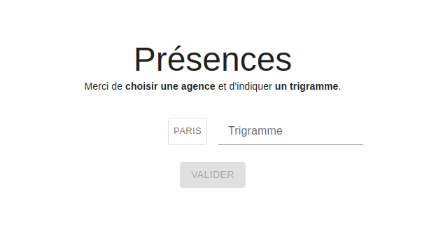
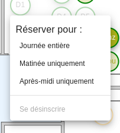
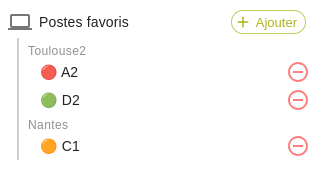

# Les Fonctionnalités

Voici l'ensemble des fonctionnalités qu'apporte l'outil `Présences`. Elles sont divisées en deux parties :
- La première liste les fonctionnalités **primaires** qui répondent au [besoin initial](./presentation.md).
- La seconde  liste les fonctionnalités **non-primaires** qui rendent l'utilisation de Présences plus agréable.

## I. Fonctionnalités Primaires

### Connexion

Sur la page d'accueil, l'utilisateur saisie le trigramme qu'il veut représenter et choisi l'agence sur laquelle il veut s'inscrire. Une fois cela fait, il arrive sur l'[Interface](./ui.md).

---

### Inscription à un poste

Pour s'inscrire, il suffit de cliquer sur un [Poste](./ui.md#poste) du plan. En fonction de son type, le comportement de l'inscription peut changer.

::: tip Pour les parkings
Chaque personne ne peut occuper qu'un seul poste. Mais, il est possible de s'inscrire sur un poste de type `parking`, en plus de son poste classique.
:::

#### Demi-journée

Par défaut, le comportement du clic inscrit l'utilisateur sur toute la journée. Au clic droit sur un poste de la carte, il est possible de s'inscrire sur une demi-journée en particulier.

::: tip Raccourci Clavier
`ctrl` + `clic-gauche` permet de s'inscrire sur la matinée  
`ctrl` + `clic-droit` permet de s'inscrire sur l'après-midi
:::

---

### Désinscription

Sur le poste inscrit, il faut soit :
- Cliquer avec le bouton gauche de la souris
- Choisir l'option de désinscription sur le menu contextuel (accessible au clic droit)

---

### Choix du plan

Accessible via la liste des [Plans](./ui#plans), il est possible de sélectionner le plan affiché par l'interface. Au changement, cela aura pour effet :
- Actualiser la carte et ses postes.
- Actualiser le calendrier et ses présences.

---

### Choix du la journée

Pour choisir la journée représentée par le plan, il faut cliquer sur une [Journée](./ui.md#journee) du [Calendrier](./ui.md#calendrier). Cela aura pour effet d'actualiser les présences représentées par chaque poste.

---

### Inscription au parking

Les places de parking sont représentées de la même manière que les postes de travail sur le plan, et l'inscription au parking depuis la carte est donc similaire à l'inscription sur un bureau.

Depuis le calendrier, l'utilisateur peut s'inscrire :
- à la fois sur son poste de travail et sur une place de parking quelconque, via le pop-up d'inscription accessible au clic du bouton "+"
- uniquement sur une place de parking en survolant le bouton "+" pour faire apparaître le bouton "P"

## II. Personnalisation de l'Expérience

L'ensemble des options de personnalisation sont accessible dans le menu de configuration, accessible en cliquant sur le trigramme de l'[Utilisateur](./ui.md#utilisateur) courant.

 

### Thème

Le thème change la couleur de l'affichage, il peut être réglé sur Sombre, Claire ou suivre le thème du système.

### Nombre de semaine

Permet de choisir combien de semaines sont affichées dans le [Calendrier](./ui.md#calendrier).

### Jours du calendrier

Offre la possibilité de réduire certaine [Journées](./ui.md#journee) voulues dans le [Calendrier](./ui.md#calendrier). Par exemple, un télétravailleur régulier qui ne se rend sur site que le lundi peut choisir de décocher tous les autres jours pour les réduire dans le calendrier.

### Jours passés

Si l'option est activée, affiche les journées passées, sinon, elles seront réduites

### Pleine lageur

Lorsque l'option est cochée, retire les espacements horizontaux de l'affichage pour le passer en pleine largeur.

### Agence par défaut

Choisir une agence par défaut revient à pré-sélectionner une agence sur la [page de connexion](#connexion).

### Poste favoris

En fonction de leur type, certains postes peuvent être ajoutés en favoris. Les favoris sont regroupés par agence.

Le clic du bouton d'action d'une [Journée](./ui.md#journee) permet d'ouvrir une fenêtre de dialogue pour sélectionner le poste où l'utilisateur veut s'inscrire. Lorsqu'un favoris est enregistré et disponible, alors il sera pré-selectionné dans cet encart. 

Dans le cas où plusieurs postes enregistrés en favoris pour une agence sont disponibles, l'orde d'ajout est pris en compte. Si le premier favori (celui en haut de la liste) est disponible, alors il est pré-sélectionné. Sinon, le second le sera, et etc.

::: tip Raccourci Clavier
`ctrl` + `clic-gauche` sur le bouton d'action permet de s'inscrire directement sur le premier favori disponible, sans ouvrir l'encart de dialogue.

Si aucun favori n'est disponible, alors la pop-up s'ouvrira normalement.
:::

### Changer de trigramme

Permet de changer le trigramme représenté, pour par exemple inscrire une autre personne.

