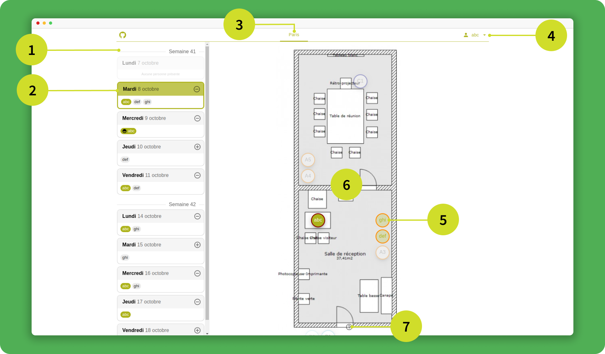
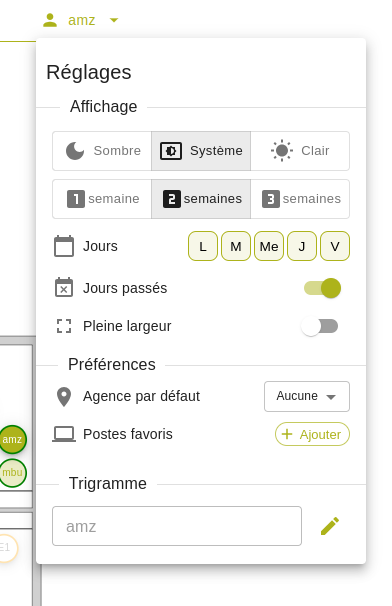

# Interface

Voici la liste des écrans de Présences et le détail de son organisation. Vous pouvez retrouver l'ensemble des fonctionnaliés sur la liste des [Fonctionnalités](./features).

## Accueil

Cette page sera l'endroit où chaque utilisateur pourra voir quel poste sont occupé ou libre, et choisir de s'inscire sur un bureau.

***1)** Calendrier **2)** Journée **3)** Plans **4)** Utilisateur **5)** Postes **6)** Cartes **7)** Légende*      

- 
1
**Calendrier**
  Le calendrier affiche la liste des jours de la semaine courante et du(des) semaine(s) suivante(s). Les journées passées sont grisées et celles à venir sont colorées normalement. Le calendrier regroupe les journées par semaine, et intitule chaque groupe avec le numéro de la semaine dans l'année.
    
- 
2
 **Journée**
  Les journées sont représentées par des cartes divisées en deux parties. La partie haute contient la date du jour, ainsi qu'un bouton permettant de s'inscrire sur un poste. La partie basse contient tous les trigrammes (identifiant d'une personne) qui se sont inscris sur un poste cette journée.
    
- 
3
 **Plans**
  La liste des plans permet de naviguer entre les différents espaces.
    
- 
4
 **Utilisateur**
  Ce trigramme représente l'utilisateur courant. En cliquant dessus, il pourra accèder au [Menu de configuration](./features#ii-personnalisation-de-lexpérience).
    
- 
5
 **Poste**
  Les postes représentent les entités qu'un utilisateur peut réserver. Il existe plusieurs types de poste, définis par la couleur de son contour(les types sont décrits dans la légende). Les postes réservés affichent le trigramme de la personne inscrite en son centre. Au survol d'un poste, les informations complémentaires de ce dernier sont affichées.
    
- 
6
 **Carte**
  La carte permet de naviguer dans les locaux. Elle est interactive, et peut donc être zoomer et déplacer.
    
- 
7
 **Légende**
  La légende décrit les différents type de postes existant sur le carte et informe sur la signification des contours des postes.
    
  
<!-- ## Menu de configuration

Lors du clic sur son trigramme, l'utilisateur aura accès au menu de configuration. 

 

Ce menu offre un ensemble de [fonctionnalité de personalisation](./features.md).  -->